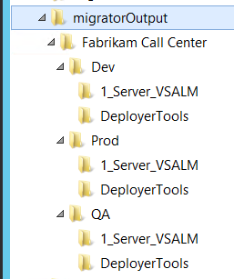
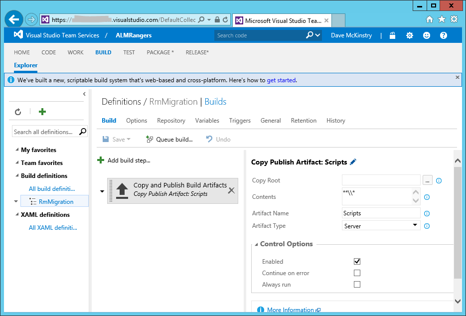
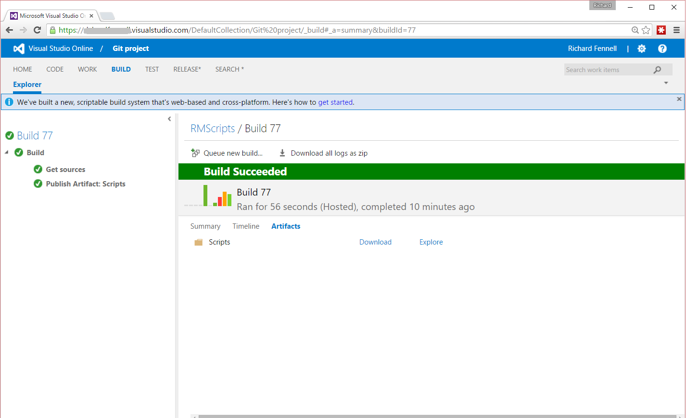
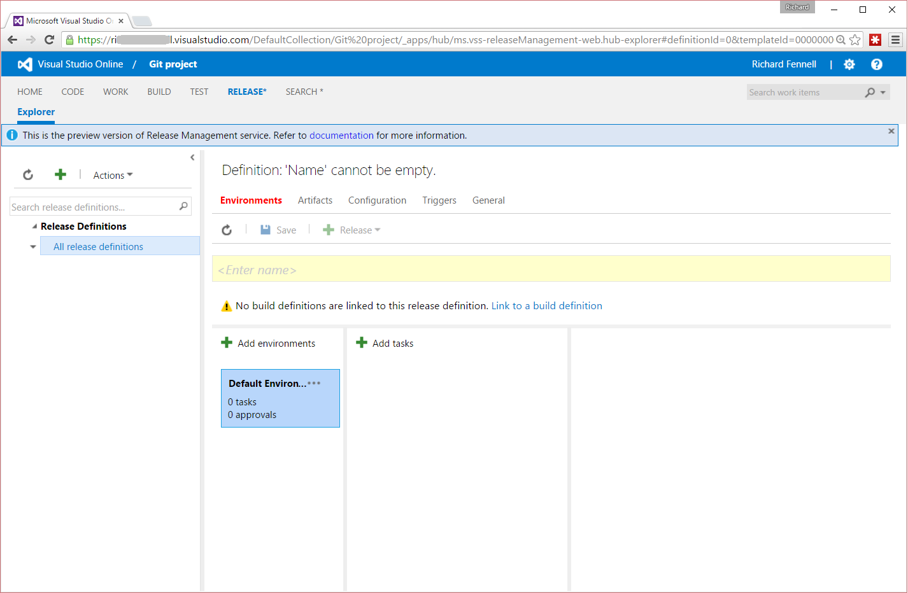
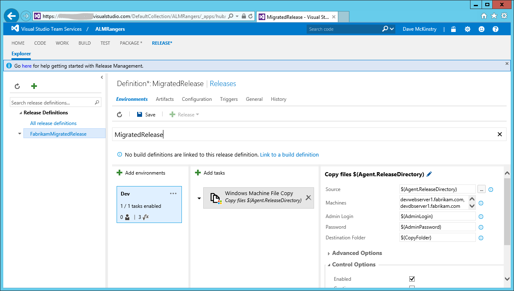

[VISUAL STUDIO ALM RANGERS](http://aka.ms/vsaraboutus)
> PREVIEW – This guide will be updated periodically.

### Introduction ###

This hand on lab (HOL) is the second in a series that provides a walk through of the use of the **RMWorkFlowMigrator** tool to export a Release Management Agent based deployment pipeline so that it can be reused as part of a Release Management service in VSTS release pipeline.

# Lab 2 - Using the resulting release scripts in a release pipeline #
 
## Preparation ##
The HOL aims to provide an overview of the process of using the PowerShell scripts generated in the first lab. Unlike the first lab in the series, it is not a complete step by step process to follow, but provides a general outline of the steps required. 

If you have not done so already follow the process in [Lab 1 - Using the RMWorkFlowMigrator to create release scripts](Lab-1-Using-the-RMWorkFlowMigrator-to-create-release-scripts.md).

Also, to complete these steps you will need to be able to upload the scripts from the ALM VM to VSTS.  You can achieve this by reconfiguring the network on the VM to connect to the Internet so that it can connect to VSTS. Or you can copy the files to the Hyper-V host and upload from the host machine.

It has been written this way because the usage of the PowerShell scripts will vary depending upon your environment.
    
## Step 1 - Storing the generated scripts in Source Control 
To make use of the generated PowerShell scripts and associated tools exported by the **RMWorkFlowMigrator** in vNext Release Templates they need to be placed in source control so they can be used as an artifact in a new pipeline.

The **RMWorkFlowMigrator** tool will have exported the steps within the agent based pipeline into a folder structure.  Assuming you started ran the steps in the previous lab from the **C:\MigratorOutput** folder, the resulting structure should look similar to the following: 

 
The method to place this folder structure under source control  will be dependent on whether the VSTS Team Project is using TFVC or Git. 

> **Note:** It is important to make sure that any exported tools in the **DeployerTools** folders, as well as the PowerShell script, are also checked into source control. This will not be the default behavior for a Git repo, where a standard [Visual Studio **.gitignore**](https://github.com/github/gitignore/blob/master/VisualStudio.gitignore) will exclude adding binary files. You need to make sure you specially add any excluded files as they are essential to the operation of the exported PowerShell scripts.
>
> **Note** This lab makes an assumption that you need to extract a work-flow for each stage because the stages differ from one another. If the stages **do not differ**, the only difference is in the parameter values used in the scripts.  This means you could just create different versions of the initial script with the correct parameter values for each stage.

## Step 2 - Update **InitializationScript.PS1**
Be especially aware of the **InitializationScript.PS1** file in each folder. These contain variables for the paths to the relevant **DeployerTools**,  non-encrypted parameters that we used in the Agent based pipeline, and non-initialised variables for any encrypted parameters. 
You will need to update this script with the corresponding values for your release before creating a build and release pipeline in VSTS. 

There are a number of options on how **passwords** and **encrypted** parameters can be handled in a new pipeline

1. You could enter the correct values for your system, in plain text, and place them under source control - not recommended as it would mean potentially secret information being stored in source control.
1. You could provide the values for the variable shown in these files using the tools in the release pipeline.
1. A mixture of the two, setting non secret, rarely changing values in the file, and overriding some of the values within the release stage.

## Step 3 - Create a build that contains the exported files 
The Release Management service relies on pulling artifacts to deploy, including scripts, from the output of a VSTS build. This means that the generated scripts and tools need to be added into an artifact by running an automated build that simply copies them to the artifact drop location. This mechanism has the advantage that you can version the scripts, like any other artifact, choosing to deploy an specific version as part of the a given release.
		
To create such a build:

1. Connect to your VSTS instance and select the Build option from the menu at the top of the page
1. Add a new build definition (green + on left of page)
1. Select the option for an empty build
1. Add the task 'Copy and Publish Build Artifacts'
	-  Set the contents to **\*\*\\\***
	-  Set the Artifact Name to **Scripts**
	-  Set the Artifact Type to **Server**
	
    
	
1. Make sure the repository is set to the repository/location where you stored your scripts
1. Queue this new build, the script files should be copied to the artifact target location

    
 
## Step 4 - Create the Release Pipeline 
Once the script artifact, and any others you require for your product, have been built, they can be used in a release deployment. The following steps show what is required to deploy and run the script artifact.

1. Connect to your VSTS instance and select the Release option on the menu at the top of the page (this will be labelled Release* while the feature is still in preview)
1. Add a new release definition (green + on left of page)
1. Select the option for an empty deployment, this will create a definition with a single default environment and no tasks.

    
	
1.	Set the new definitions name
1.  Click the **Default Environment** and rename it to your first stage e.g. to **Dev**
1.  Press the ** Add Task** button and add the **Deploy** task **Windows Machine File Copy**. Set the following settings
	- Set the **Source** to **$(Agent.ReleaseDirectory)**
	- Click the manage button next to the **Machine Group**. A new tab will open, create a new machine group called **Dev** this should define the target VMs to deploy too.
	- Once you have defined your machines, return to the browser window showing the Release Definitions. Press the refresh button next to the **Machine Group** combo and select the newly created **Dev** machine group
	- Set the **Destination folder** to the target location on the VM e.g. a variable for the release called **$(CopyFolder)** which is created and initialized on the **Configuration** tab
	
    
	
1.  Press the **Add Task** button again and add the **Deploy** task '**PowerShell on Target Machines**'. This task needs to be configured to run the scripts the migration tool generated
	- Set the **Machine Group** to **Dev**
	- Set the **PowerShell Script** to run your targeted script from the deployment location e.g. **$(CopyFolder)\Scripts\Dev\1_Server_VSALM\ReleaseScript.ps1**
	- If you have chosen to store your initialisation script in source control, set the **Initialization Script** to **$(CopyFolder)\Scripts\Dev\1_Server_VSALM\InitializationScript.ps1**
	- If you have not, or plan to override some of the variable, then set the values for the variables in the initialization script in the Advanced pane's **Session Variables**  
	
    
	
1.  The initial **Dev** stage of the definition can now be saved.
1.  This process of adding a task can be repeated call further exported PowerShell scripts within the same Stage to deploy to a other VMs.
1.  Finally further environments and stages e.g: **QA** and **Prod** can be added, each with their own series and tasks and parameters.
1.  The release pipeline can now be run.

## Summary 
By following this HOL you should now understand how to make use of the exported scripts from the **RMWorkFlowMigrator** tool.

---
- **Richard Fennell** is a Visual Studio ALM Ranger 
- **Dave McKinstry** is Visual Studio ALM Ranger and Technical Specialist at Microsoft
- **William H. Salazar** is a Visual Studio ALM Ranger and Sr. Consultant at InCycle Software
